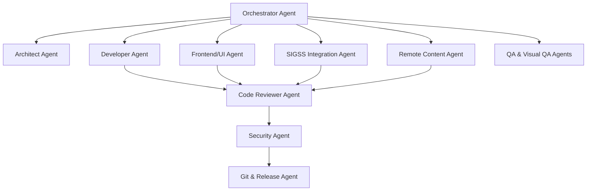
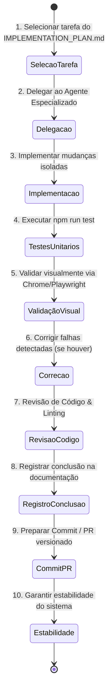

# Estratégia da Equipe Multiagente e Autonomia Controlada — Painel SIGSSe 2.0

> **Status**: Especificação de Operação Multiagente  
> **Objetivo**: Estruturar a cooperação, especialização, governança e prevência de conflitos entre múltiplos agentes de IA e humanos.

---

## 1. Organograma da Equipe de Agentes Especializados

Para acelerar o desenvolvimento, manter alta qualidade de código e garantir testes visuais rigorosos, o projeto adota uma equipe especialista dividida em papéis complementares:

---

## 2. Matriz de Responsabilidade e Escopo de Edição

| Agente | Arquivos Sob Sua Responsabilidade | Ferramentas & Modos de Ação |
| :--- | :--- | :--- |
| 👑 **Orchestrator** | `docs/architecture/IMPLEMENTATION_PLAN.md`, `AGENTS.md`, `package.json` | Coordenar pipeline, delegar tarefas, verificar status global. |
| 🏛️ **Architect** | `src/types/`, `src/core/interfaces/`, `docs/architecture/` | Definir assinaturas de métodos, interfaces TypeScript e padrões. |
| 💻 **Developer** | `src/core/`, `src/mascot/`, `src/campaign/` | Implementar física, FSM de animação, lógica de negócio. |
| 🎨 **Frontend/UI** | `src/ui/`, `mock/`, `assets/` | Construir HTML/CSS do popup, estilização dos mascotes e skins. |
| 🏥 **SIGSS Integration** | `src/adapter/`, `src/utils/` | Aperfeiçoar o parser DOM, seletores heurísticos e física de obstáculos. |
| 🌐 **Remote Content** | `src/content/`, `content/`, `schemas/` | Implementar provedores (GitHub, Cache, Fallback) e validação Zod. |
| 🧪 **QA & Visual QA** | `tests/`, `mock/` | Escrever e executar suítes de teste unitário (Vitest) e testes visuais (Playwright). |
| 🔒 **Security** | `src/manifest.json`, `docs/security/` | Sanitização de dados, CSP do Manifest V3, auditoria de código. |
| 🔍 **Code Reviewer** | Todo o repositório (Read-only + Sugestões) | Lint check, typecheck, auditoria de padrões e boas práticas. |
| 🚀 **Git/Release** | `dist/`, `.github/`, `CHANGELOG.md` | Gerar builds de produção, gerenciar tags Git e notas de versão. |

---

## 3. Prevenção de Conflitos e Persistência de Contexto

1. **Locks por Módulo / Diretório**:
   - Dois agentes nunca devem alterar o mesmo arquivo simultaneamente.
   - O **Orchestrator** é responsável por garantir que as tarefas delegadas sejam ortogonais.

2. **Uso de Git Worktrees**:
   - Para tarefas paralelas extensas (ex: redesenho da UI do Popup vs criação do motor de cache remoto), os agentes trabalham em diretórios isolados via Worktree:
     - `../sigss-worktree-ui`
     - `../sigss-worktree-cache`

3. **Registro de Decisões Arquiteturais (ADR)**:
   - Qualquer decisão que altere o fluxo original ou que resolva um impasse técnico deve ser documentada em `docs/decisions/ADR-XXX.md`.

---

## 4. Autonomia Controlada (Orquestração em 10 Etapas)

Cada ciclo de trabalho executado pelo Agente Orquestrador deve seguir impreterivelmente o fluxo de 10 passos:

---

## 5. Política de Autonomia e Travas de Segurança

- **Ações Livres (Permitidas sem Confirmação)**:
  - Ler arquivos, analisar código e realizar pesquisas.
  - Executar testes unitários e linting.
  - Criar novos arquivos em `src/`, `tests/` ou `docs/`.
  - Criar commits em branches locais de feature.

- **Ações com Confirmação Obrigatória do Usuário**:
  - Alterações destrutivas (excluir arquivos legados de grande porte sem substituto direto).
  - Publicação/Push direto para a branch `main` de produção.
  - Modificação de permissões do navegador em `manifest.json`.
