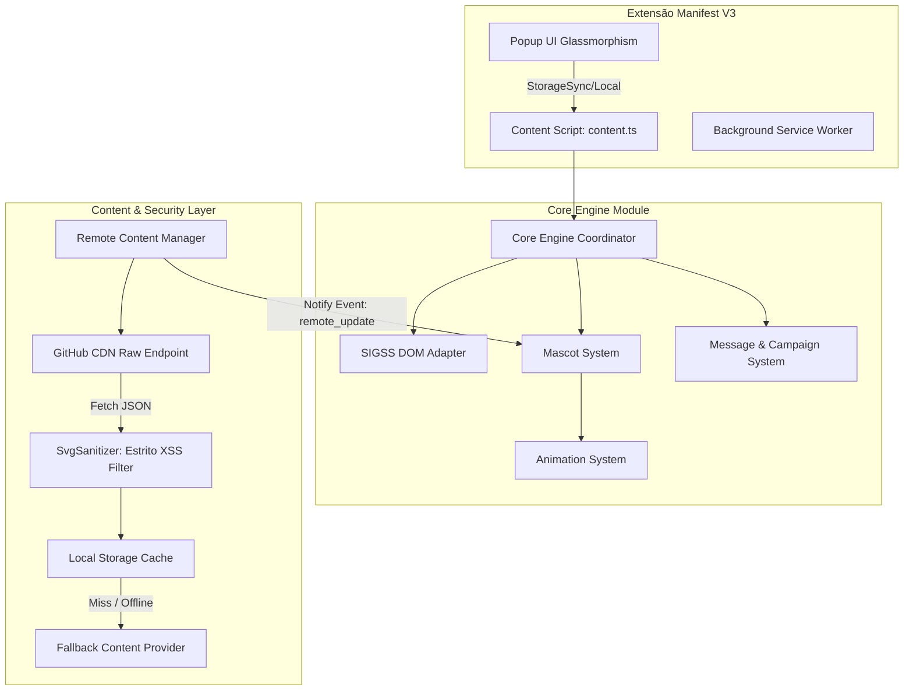

# Arquitetura do Sistema — Painel SIGSSe 2.0

> **Status**: Arquitetura de Produção Reforçada e Validada  
> **Autor**: Arquiteto Principal & Orquestrador Técnico  
> **Alvo**: Produção (Substituição Integral do Sistema Legado)

---

## 1. Visão Geral da Arquitetura

O **Painel SIGSSe 2.0** é uma plataforma de mascotes interativos e exibição contextual de campanhas de saúde para o painel de chamadas do sistema SIGSS (Unique Panel / MV).

A arquitetura adota o padrão **Clean Architecture + Component-Based Event-Driven Engine**, com desacoplamento rigoroso entre a extensão Manifest V3, o motor de física/animação, o adaptador DOM do SIGSS, o sanitizador de SVG estrito e o gerenciador de conteúdo remoto com hot-reload visual e fallback offline.

---

## 2. Detalhamento dos Componentes Principais

### 2.1 Core Engine (`src/core/content.ts` & `src/mascot/MascotEngine.ts`)
- **Responsabilidade**: Orquestra o ciclo de vida do sistema, escuta mutações do DOM e eventos da extensão, coordena o loop de animação (`requestAnimationFrame`) e responde a eventos de hot-reload remoto.
- **Física e FSM**: Gerencia os estados de animação (`IDLE`, `WALK`, `RUN`, `JUMP`, `FALL`, `CLIMB`, `CELEBRATE`, `SPEAKING`, `DRAGGED`).

### 2.2 Remote Content Manager & Sanitização (`src/content/` & `src/utils/svgSanitizer.ts`)
- **Versão de Conteúdo**: Controlada via esquemas separados:
  - `contentVersion`: Formato `YYYY.MM.DD.NNN` (ex: `2026.08.08.001`)
  - `schemaVersion`: Major.minor (ex: `1.0`)
  - `minExtensionVersion`: (ex: `2.0.0`)
- **Sanitizador SVG**: Bloqueia `<script>`, `onload=`, `onclick=`, `javascript:`, e tags perigosas em SVGs baixados da rede antes da renderização.
- **Hot-Reload Visual**: Quando uma nova versão válida é baixada em background, dispara evento notificando o `MascotRenderer` para atualizar a skin na tela instantaneamente sem reload da extensão.

### 2.3 SIGSS Integration Adapter (`src/utils/sigssPanelAdapter.ts`)
- **Responsabilidade**: Abstrai as consultas ao DOM do painel oficial (`MV | Unique Panel`) e do mock local.
- **Leitura Estritamente Passiva (Read-Only)**: Em ambiente real, não executa nenhuma alteração de dados do sistema SIGSS.

---

## 3. Requisitos Tecnológicos e Validação

- **Linguagem**: TypeScript 5.4+ (Strict Mode sem supressões)
- **Bundler**: esbuild (`build.js`)
- **Testes Unitários**: Vitest (14 testes em 5 arquivos)
- **Visual Testing**: Subagente Browser no Chrome (Mock Local e Painel Real SIGSS)
- **Browser Target**: Chrome Manifest V3 (`host_permissions`: SIGSS Betim + GitHub Raw)
