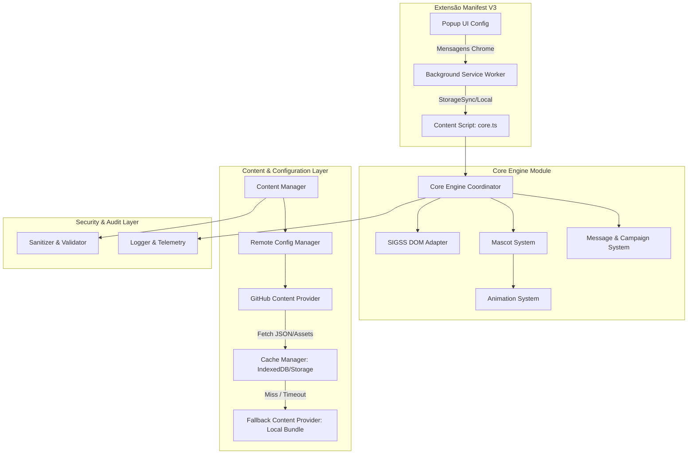
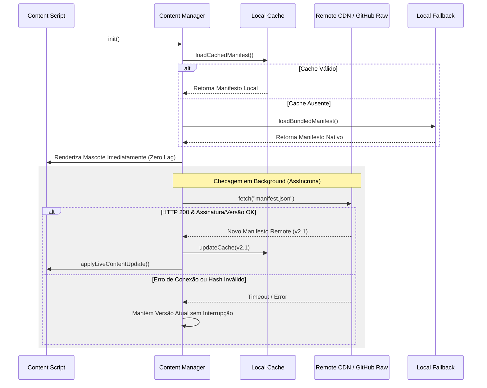

# Arquitetura do Sistema — Painel SIGSSe 2.0

> **Status**: Proposta Arquitetural Principal  
> **Autor**: Arquiteto Principal & Orquestrador Técnico  
> **Alvo**: Produção (Substituição Integral do Sistema Legado)

---

## 1. Visão Geral da Arquitetura

O **Painel SIGSSe 2.0** é uma plataforma de mascotes interativos e exibição contextual de campanhas de saúde para o painel de chamadas do sistema SIGSS (Unique Panel / MV).

A nova arquitetura adota o padrão **Clean Architecture + Component-Based Engine**, com desacoplamento rigoroso entre a camada de extensão do navegador, o motor de física/animação, a camada de integração DOM com o SIGSS e o gerenciador de conteúdo remoto com fallback offline resiliênte.

---

## 2. Detalhamento dos Componentes Principais

### 2.1 Core Engine (`src/core/CoreEngine.ts`)
- **Responsabilidade**: Orquestra o ciclo de vida do sistema, escuta mutações do DOM e eventos da extensão, coordena o loop de animação (`requestAnimationFrame`) e distribui estados para os mascotes ativos.
- **Isolamento**: Não manipula diretamente o DOM do SIGSS nem faz fetches remotos. Comunica-se via interfaces (`ISigssAdapter`, `IContentProvider`, `IMascotController`).

### 2.2 Content Manager & Remote Configuration (`src/content/`)
- **Responsabilidade**: Gerencia o ciclo de atualização de conteúdos (mensagens, campanhas, mascotes, skins e animações).
- **Provedores**:
  1. **GitHub Content Provider**: Consulta o repositório remoto ou CDN Raw (`raw.githubusercontent.com` ou Cloudflare Pages / GitHub Pages) buscando a versão `latest.json`.
  2. **Cache Manager**: Armazena em `chrome.storage.local` / `IndexedDB` a última versão válida do conteúdo e os assets binários (PNG, SVG, áudio).
  3. **Fallback Provider**: Se o servidor remoto falhar ou o cliente estiver offline, carrega instantaneamente os assets locais empacotados no bundle da extensão (`assets/fallback/`).

### 2.3 Mascot & Animation System (`src/mascot/`)
- **Responsabilidade**: Gerencia instâncias físicas de mascotes, gravidade, movimentação no topo das janelas/elementos do SIGSS e troca dinâmica de skins.
- **Skin System**: Suporta skins vetoriais (SVG), spritesheets (PNG) e customizações de cores/acessórios.
- **Animation System**: Máquina de estados finitos (FSM) que controla animações como: `IDLE`, `WALK`, `RUN`, `CELEBRATE` (quando paciente é chamado), `TALK` (exibindo balão de campanha) e `SLEEP`.

### 2.4 SIGSS Integration Adapter (`src/adapter/`)
- **Responsabilidade**: Abstrai as consultas ao DOM do painel oficial e do mock local.
- **Recursos**:
  - Seletores diretos e heurísticas resilientes baseadas na hierarquia estrutural da página.
  - Observador de chamadas via `MutationObserver` no container do paciente ativo.
  - Cálculo de caixas de colisão físicas (rects de guichê, cabeçalho e histórico) para evitar que o mascote sobreponha dados médicos críticos.

### 2.5 Message & Campaign System (`src/campaign/`)
- **Responsabilidade**: Seleciona e exibe mensagens dinâmicas de conscientização em saúde (ex: Zé Gotinha, Novembro Azul, Outubro Rosa, Dicas de Nutrição).
- **Recursos**:
  - Filtragem por data, prioridade e categoria.
  - Validação de segurança (sanitização contra XSS em balões de texto).

---

## 3. Fluxo de Atualização Automática de Conteúdo Remoto

---

## 4. Requisitos Tecnológicos e Ferramentas

- **Linguagem**: TypeScript 5.4+ (Strict Mode)
- **Bundler**: esbuild / Vite
- **Testes Unitários**: Vitest
- **Testes Visuais & E2E**: Playwright (executando em ambiente Chrome headless com `mock_panel.html`)
- **Linting & Formatação**: ESLint + Prettier
- **Browser Target**: Chrome Manifest V3 (Chrome 100+)
