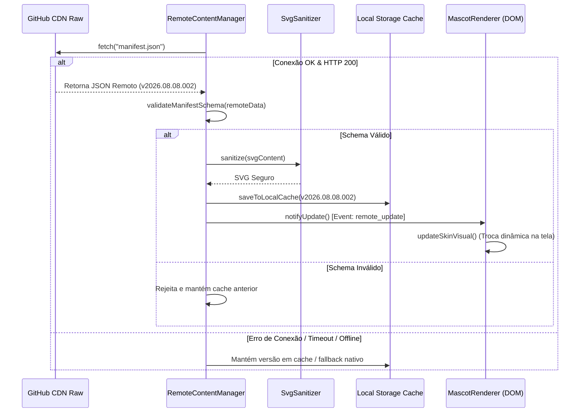

# Estrutura de Conteúdo Remoto e Versionamento — Painel SIGSSe 2.0

> **Status**: Especificação Técnica Validada  
> **Objetivo**: Permitir atualização contínua de mascotes, skins, mensagens e campanhas sem necessidade de recompilar a extensão.

---

## 1. Versionamento Separado (Código vs Conteúdo)

Para garantir autonomia na criação de campanhas de saúde sem gerar novas compilações da extensão Chrome:

- **Versão do Código (Extensão)**: `2.x.x` (definida em `package.json` e `manifest.json`).
- **Versão do Conteúdo**: `YYYY.MM.DD.NNN` (exemplo: `2026.08.08.001`).
- **Versão do Schema**: `Major.minor` (exemplo: `1.0`).

```json
{
  "contentVersion": "2026.08.08.001",
  "schemaVersion": "1.0",
  "minExtensionVersion": "2.0.0",
  "updatedAt": "2026-08-08T19:30:00Z",
  "mascots": [...],
  "campaigns": [...]
}
```

---

## 2. Pipeline de Atualização Dinâmica (Hot-Reload)



---

## 3. Resiliência de Falha de Rede e Fallback
1. **Primeira Execução (Sem Cache)**: Se o GitHub estiver inacessível, o sistema utiliza o `FALLBACK_MANIFEST` embutido (`src/content/fallbackManifest.ts`).
2. **Execuções Posteriores**: Utiliza o cache local imediatamente (0 ms) e checa atualizações em background.
3. **Payload Corrompido ou Malicioso**: O validador de schema rejeita o payload e o `SvgSanitizer` remove quaisquer scripts, mantendo a estabilidade e a segurança do painel.
