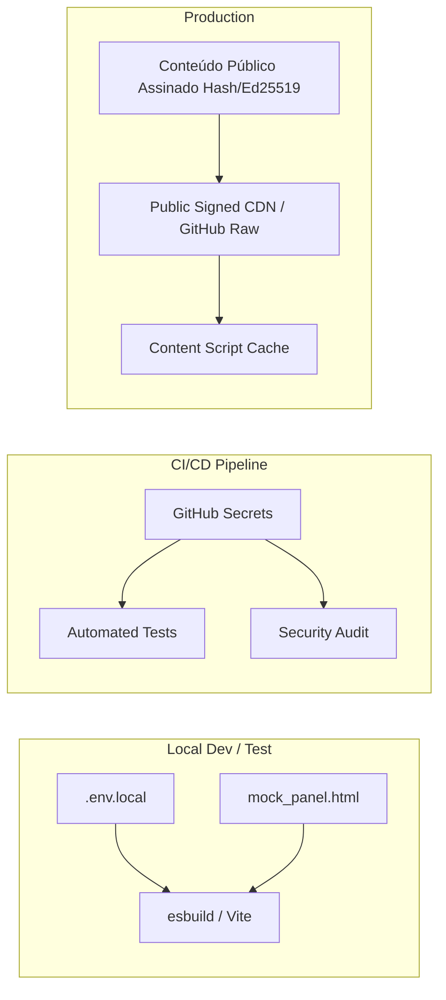

# Política de Segurança e Gestão de Credenciais — Painel SIGSSe 2.0

> **Status**: Especificação de Segurança de Produção  
> **Objetivo**: Garantir segurança estrita em extensões Manifest V3, prevenir vazamento de segredos e proteger a integridade do SIGSS.

---

## 1. Princípios de Segurança em Extensões Chrome Manifest V3

### 1.1 Modelo de Privilégio Mínimo (Principle of Least Privilege)
- **Content Scripts**: Executam no contexto do DOM da página do SIGSS, porém em um contexto de execução isolado (Isolated World). Não possuem acesso às variáveis globais da página nem a tokens do SIGSS.
- **Background Service Worker**: Possui acesso às APIs do Chrome (`chrome.storage`, `chrome.runtime`), mas não acessa o DOM diretamente.
- **Host Permissions**: Limitadas estritamente ao domínio do painel (`http://sigss.betim.mg.gov.br/unique-panel/*`) e ao CDN seguro de conteúdo (`https://raw.githubusercontent.com/*` ou CDN HTTPS equivalente).

### 1.2 Zero Hardcoded Secrets (Proibição Absoluta de Segredos em Código)
- **Extensões de navegador são cliente público**: Qualquer código, token, chave de API ou credencial empacotada em uma extensão Chrome ou enviada para repositório público pode ser extraída via descompilação do `.crx` ou leitura de código.
- **NENHUMA SENHA OU TOKEN PRIVADO DEVE SER INCLUÍDO NO REPOSITÓRIO OU BUNDLE.**

---

## 2. Estratégia por Ambiente

### 2.1 Ambiente Local (Desenvolvimento)
- Utilização de arquivo `.env.local` (ignorado pelo `.gitignore`) para variáveis locais de desenvolvimento.
- Testes locais utilizando `mock/mock_panel.html` sem necessidade de requisições autenticadas.

### 2.2 Ambiente de Testes (CI/CD)
- Chaves de automação e tokens de deploy configurados exclusivamente via **GitHub Actions Secrets**.

### 2.3 Ambiente de Produção
- O conteúdo remoto (skins, mensagens, campanhas) é distribuído como **assets estáticos públicos assinados por hash (SHA-256)**.
- Caso no futuro seja necessária integração com backend proprietário autenticado:
  - Deve-se utilizar o padrão **Backend Proxy / OAuth PKCE** onde o Service Worker realiza a autenticação usando Tokens de Curta Duração (JWT com expiração em minutos), nunca armazenando senhas mestre.

---

## 3. Prevenção de Injeção de Código (XSS) e Sanitização

1. **Inner HTML Sanitization**:
   - Todo conteúdo remoto renderizado nos balões de fala dos mascotes deve obrigatoriamente passar por sanitização rígida (utilizando `DOMPurify` ou biblioteca de sanitização equivalente).
   - Bloqueio completo de `<script>`, `onload=`, `javascript:`, e elementos de mídia externos arbitrários.

2. **Content Security Policy (CSP)**:
   - Respeito estrito ao CSP do Manifest V3:
     `script-src 'self'; object-src 'self'`
   - Proibição do uso de `eval()`, `new Function()` ou execução de código stringizado.

---

## 4. Auditoria e Conformidade

- **Verificação Pré-Commit**: Hook de git que escuta padrões de chaves API (ex: `ghp_`, `AKIA...`, `sk_live...`, senhas em texto puro) bloqueando commits acidentais.
- **Auditoria do Code Reviewer / Security Agent**: Revisão obrigatória do arquivo `manifest.json` antes de qualquer mesclagem para a branch `main`.
